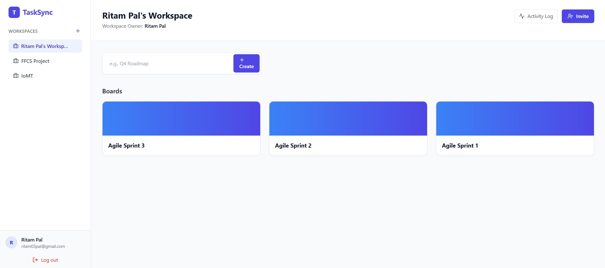
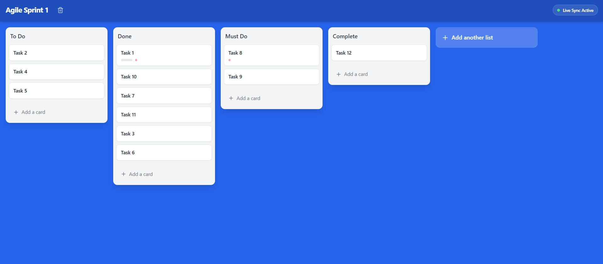
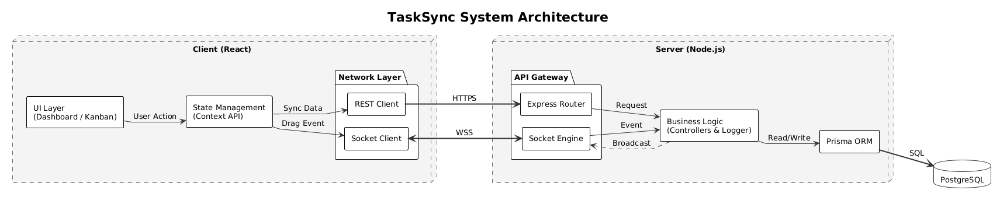

# TaskSync

TaskSync is an enterprise-grade Project Management System designed for agile teams. It features real-time collaboration, strict Role-Based Access Control (RBAC), and granular activity auditing, mimicking the core functionality of industry-standard tools like Trello or Jira.

## System Architecture

TaskSync utilizes a Hybrid Architecture, leveraging REST APIs for standard data management and WebSockets for sub-millisecond updates. This dual-transport strategy ensures data integrity via ACID-compliant database transactions while providing an immediate, "optimistic" UI experience for users.

## Key Features

* **Real-Time Collaboration**: Powered by Socket.io, all board updates—including drag-and-drop actions, list creation, and card edits—sync instantly across all connected clients without requiring a page refresh.
* **Multi-Tenant Workspaces**: Support for multiple isolated workspaces allows users to separate distinct workflows (e.g., Engineering, Marketing, Sales) within a single account.
* **Role-Based Access Control (RBAC)**:
    * **Owners**: Full control over the workspace lifecycle, including permanent deletion.
    * **Admins**: Capability to manage boards and invite or remove team members.
    * **Members**: Collaborative access to create tasks, move cards, and add comments.
* **Granular Audit Logs**: An industry-standard activity feed that tracks specific user actions with context-aware details (e.g., "User A moved Card X to Done in Board Y").
* **Interactive Kanban Boards**: A fluid, responsive drag-and-drop interface powered by @hello-pangea/dnd.
* **Live Notifications**: Real-time badge counters that increment dynamically when activity occurs while the log sidebar is closed.

## Tech Stack

* **Frontend**: React (Vite), Tailwind CSS, Lucide Icons, Socket.io Client
* **Backend**: Node.js, Express.js, Socket.io Server
* **Database**: PostgreSQL, Prisma ORM
* **Authentication**: JWT (JSON Web Tokens) with HttpOnly cookies